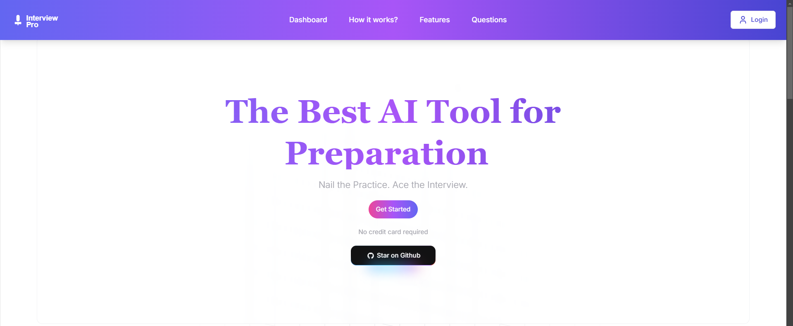
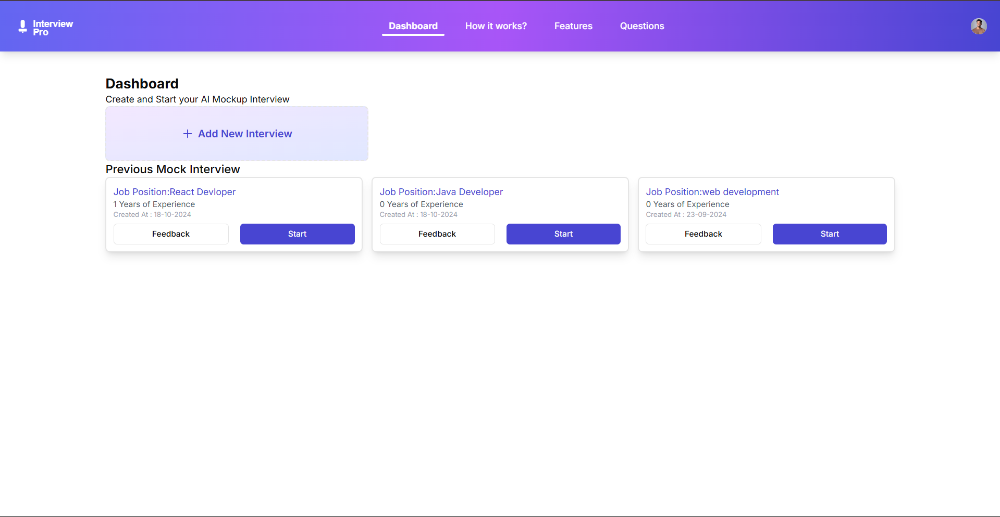
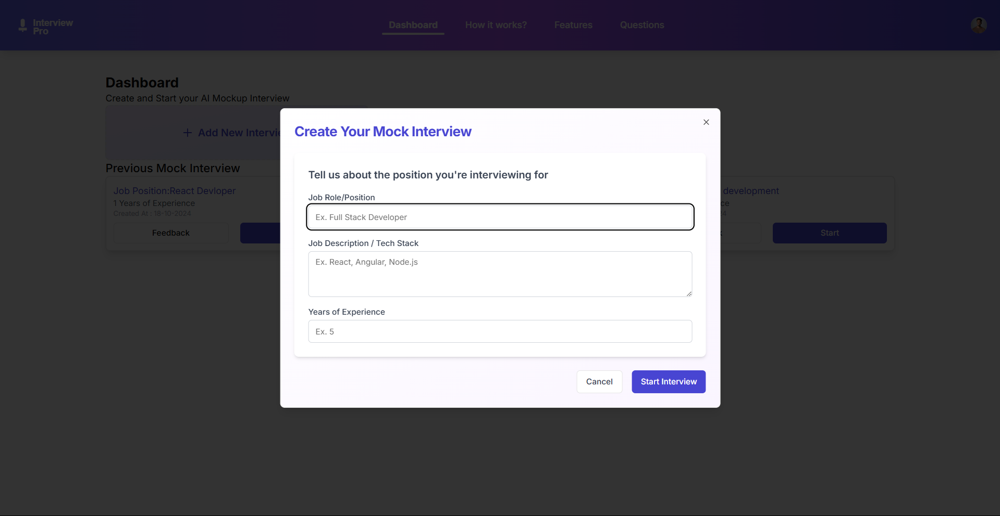
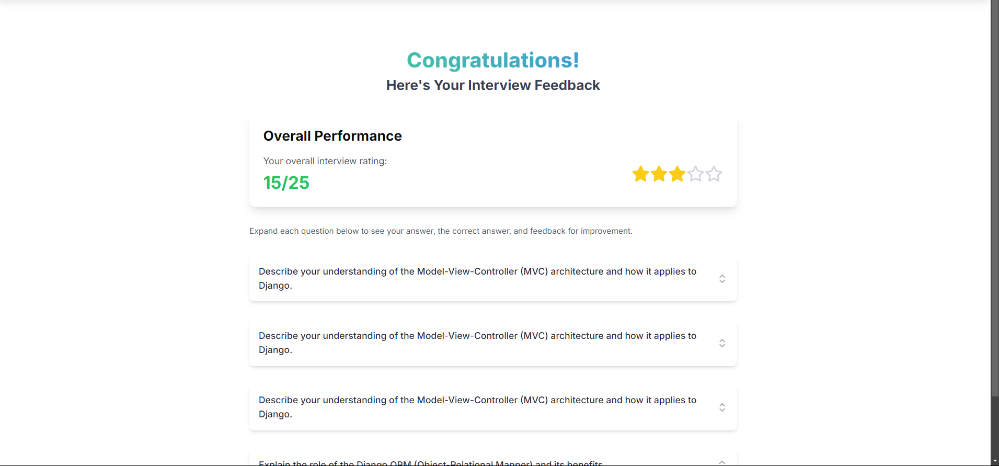

# AI Mock Interview Platform

An intelligent interview preparation platform that helps users practice and improve their interviewing skills using AI-powered feedback and analysis.


*(Add a screenshot of your hero section with the animated background)*

## ✨ Features

- **AI-Powered Mock Interviews**: Practice with realistic interview scenarios
- **Real-time Feedback**: Get instant analysis of your responses
- **Interactive UI**: Beautiful and responsive design with animated backgrounds
- **Progress Tracking**: Monitor your improvement over time
- **Custom Interview Types**: Practice for different roles and industries

## 🛠️ Tech Stack

- **Frontend**: Next.js 14, React, TailwindCSS
- **Animations**: Three.js for 3D animations
- **Authentication**: Clerk
- **UI Components**: Custom components with glassmorphism effects
- **Styling**: TailwindCSS with custom animations

## 🚀 Getting Started

1. Clone the repository:
```bash
git clone https://github.com/AshishDev-16/ai-mock-interview.git
```

2. Install dependencies:
```bash
npm install
```

3. Set up environment variables:
```bash
cp .env.example .env.local
# Add your environment variables
```

4. Run the development server:
```bash
npm run dev
```

Open [http://localhost:3000](http://localhost:3000) to view the application.

## 📸 Screenshots

### Dashboard



### Interview Session



### Feedback Analysis

    
## 🔑 Environment Variables

The project requires the following environment variables:

```env
NEXT_PUBLIC_CLERK_PUBLISHABLE_KEY=
CLERK_SECRET_KEY=
NEXT_PUBLIC_CLERK_SIGN_IN_URL=
NEXT_PUBLIC_CLERK_SIGN_UP_URL=
NEXT_PUBLIC_CLERK_AFTER_SIGN_IN_URL=
NEXT_PUBLIC_CLERK_AFTER_SIGN_UP_URL=
```

## 🤝 Contributing

Contributions are welcome! Please feel free to submit a Pull Request.

1. Fork the project
2. Create your feature branch (`git checkout -b feature/AmazingFeature`)
3. Commit your changes (`git commit -m 'Add some AmazingFeature'`)
4. Push to the branch (`git push origin feature/AmazingFeature`)
5. Open a Pull Request

## 📝 License

This project is licensed under the MIT License - see the [LICENSE](LICENSE) file for details.
